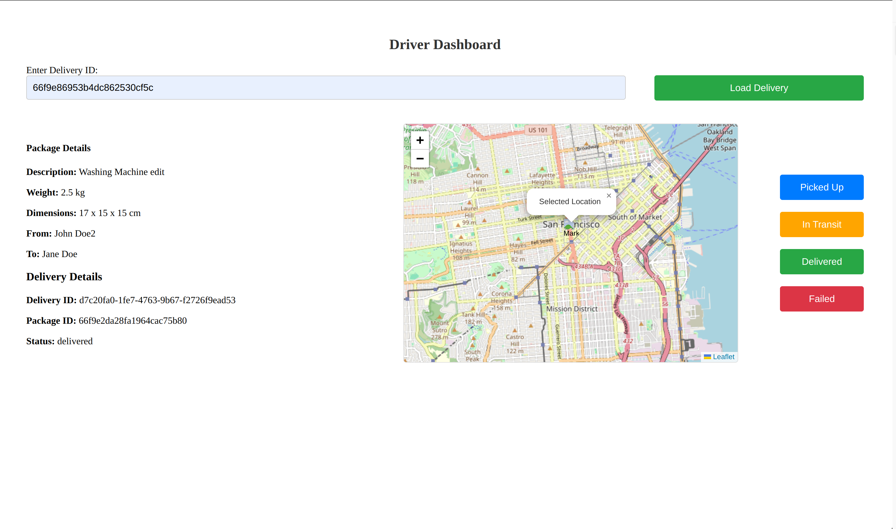

# Package-Tracker


A MEAN stack-based package tracking web application with real-time updates, user roles (customer, driver, admin), and REST APIs, utilizing Docker for containerization and Jasmine for back-end testing.

```
package-tracking/
│
├── backend/                 # Backend (API, WebSocket server, etc.)
│   └── README.md            # Instructions for running the backend
│
├── frontend/                # Frontend (Angular app)
│   └── README.md            # Instructions for running the frontend
│
├── docker-compose.yml       # Docker Compose configuration to run both backend and frontend
└── README.md                # This file
```


## Running Both Projects Simultaneously with Docker

To simplify running both the **frontend** and **backend**, Docker and Docker Compose are used to build and manage both applications in one command.

### Prerequisites

- [Docker](https://www.docker.com/get-started) >= 20.x
- [Docker Compose](https://docs.docker.com/compose/) >= 1.29.x

### Steps to Run

1. **Clone the Repository**:

    ```bash
    git clone https://github.com/DriZy/Package-Tracker.git
    cd cd Package-Tracking
    ```

2. **Create Environment Variables**:
   - Create a `.env` file in the `backend` directory and add the following environment variables for MongoDB, JWT secret, and other configurations:

   Backend `.env` file:

    ```bash
    MONGO_URI=mongodb://mongo:27017/package_tracker
    JWT_SECRET=your_jwt_secret
    BCRYPT_SALT=10
    PORT=3000
    ```

   Frontend `.env` file (if required):

   Add any necessary environment variables for the frontend (usually Angular handles configurations with environment files inside the project).

3. **Run Both Projects with Docker Compose**:

   Simply use Docker Compose to build and run both the backend and frontend:

    ```bash
    docker compose up --build
    ```

   This will build the Docker images for both the backend and frontend, start the containers, and link them together along with MongoDB.

4. **Access the Applications**:
   - **Backend API** will be available at: `http://localhost:3000`
   - **Frontend Application** will be available at: `http://localhost:4200`

5. **Shut Down the Containers**:

   To stop the containers and remove them, run:

    ```bash
    docker compose down
    ```

## Pull Pre-built Docker Images from Docker Hub

If you don’t want to build the Docker images locally, you can pull the pre-built images directly from Docker Hub (assuming you have pushed the images there).

1. Modify the `docker-compose.yml` to reference the existing images from Docker Hub.

Example for backend and frontend images in Docker Hub:

```yaml
services:
  backend:
    image: tabiidris/package-tracker-backend:latest
    ports:
      - "3000:3000"
    environment:
      - MONGO_URI=mongodb://mongo:27017/package_tracker
      - JWT_SECRET=your_jwt_secret
      - BCRYPT_SALT=10
      - PORT=3000
    depends_on:
      - mongo

  frontend:
    image: tabiidris/package-tracking-frontend:latest
    ports:
      - "4200:80"
    depends_on:
      - backend

  mongo:
    image: mongo:latest
    ports:
      - "27017:27017"